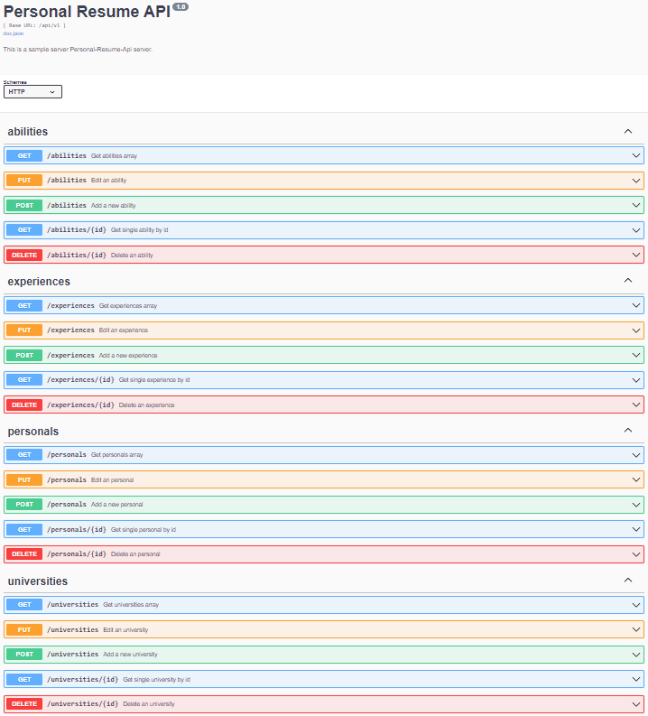

# Go RESTful API with Gin Web Framework & PostgreSQL
This is an example golang backend application using PostgreSQL database with clean architecture.

## Features
* Go Web Framework ([gin-gonic](https://github.com/gin-gonic/gin))
* Containerize ([docker](https://www.docker.com/))
* Swagger ([swaggo](https://github.com/swaggo/swag))
* CRUD operations
* JWT for authentication
* Mock: [golang/mock](https://github.com/golang/mock)
* PostgreSQL Driver: [GORM](gorm.io/gorm)
* Test Assertions: [stretchr/testify](https://github.com/stretchr/testify)

## Getting Started

```sh
# download the project
git clone https://github.com/aabdullahgungor/personel-resume-api.git

cd personel-resume-api
```

### Build and run image of docker

```bash
docker-compose up  --build  -d
```

### Open API Doc Preview
http://localhost:8000/api/v1/swagger/index.html


